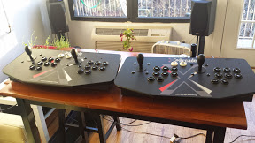
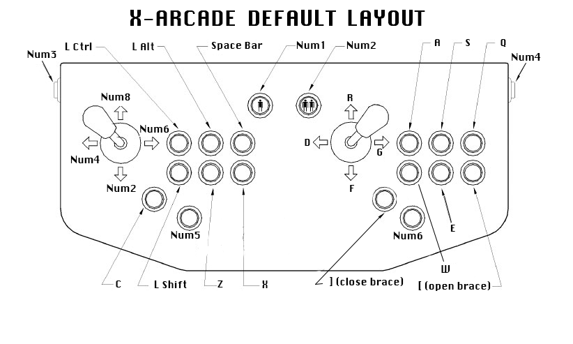
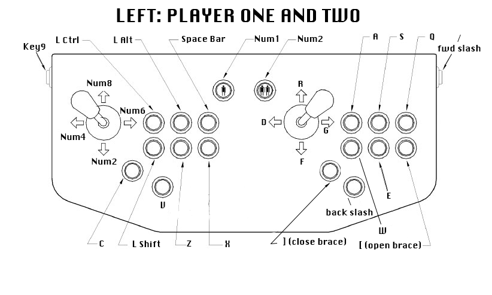
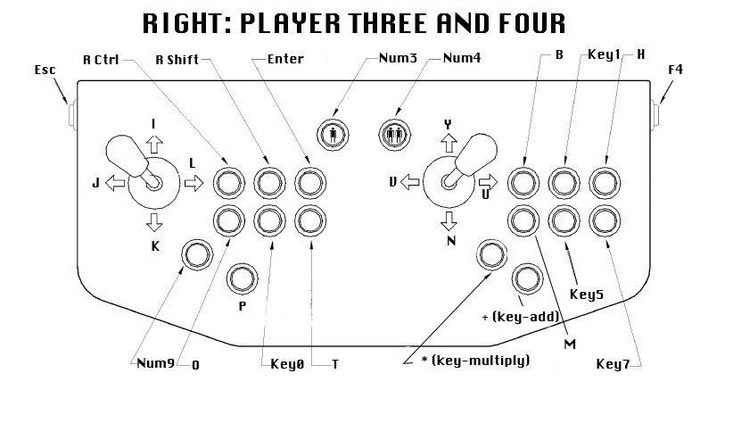

RetroPie with Two Dual X-Arcade Joysticks
============================

Repo for setting up RetroPie with two dual-joystick X-Arcades. Includes the configuration file, retroarch.cfg, which has been tested and works with the exact hardware and software setups below.



## Hardware Requirements

* Raspberry Pi b+
* 2 X-Arcade Dual Joysticks
* ps/2 keyboard (old style keyboard connection, [wikipedia](http://en.wikipedia.org/wiki/PS/2_port))

## Software Requirements

* [RetroPie SD Card Image](http://blog.petrockblock.com/download/retropie-project-image/)
* text editor
* a way to ssh into the Raspberry Pi

## Steps to get it up and running

1. Install RetroPie as per [this fantastic lifehacker post](http://lifehacker.com/how-to-turn-your-raspberry-pi-into-a-retro-game-console-498561192).
    * **NOTE: Do NOT do step three**
2. SSH into your RetroPie and open retroarch.cfg
    * location: `/opt/retropie/configs/all/retroarch.cfg`
4. Connect your second X-Arcade to a computer and the ps/2 keyboard to the x-arcade
    * you only need to connect it to a computer to power the X-Arcade
5. Follow [X-Gaming's joystick programming instructions](http://www.xgaming.com/support/questions/15/X-Arcade%E2%84%A2+Programming+Guide) and program the second X-Arcade to match the Player 3 and Player 4 keyboard setups.
    * [download instructions file - with pictures!](images/x-arcade-programming-instructions-with-button-layout.jpg)
6. Reboot RasPi
7. Profit

## A note on Arcade Mames

For whatever reason, the mapping doesn't match in Mame. For instance, for player one the joysticks are up/down/left/right, not the keypad numbers.

To fix, connect a keyboard to your RasPi and go update the system-wide controls while inside any MAME game by hitting `tab`. Test your games...I ran into a few other MAME's that needed updating.

Just do it. You know this is your whole weekend plan anyway.

## What's different in this retroarch.cfg

### Configuration for four players:

This programming matches my X-Arcade configuration.

```
input_exit_emulator = esc
input_player1_a = z
input_player1_b = shift
input_player1_down = keypad2
input_player1_l = space
input_player1_left = keypad4
input_player1_r = x
input_player1_right = keypad6
input_player1_select = num5
input_player1_start = num1
input_player1_up = keypad8
input_player1_x = alt
input_player1_y = ctrl
input_player2_a = e
input_player2_b = w
input_player2_down = f
input_player2_l = q
input_player2_left = d
input_player2_r = [
input_player2_right = g
input_player2_select = num6
input_player2_start = num2
input_player2_up = r
input_player2_x = s
input_player2_y = a
input_player3_a = keypad0
input_player3_b = o
input_player3_down = k
input_player3_l = enter
input_player3_left = j
input_player3_r = t
input_player3_right = l
input_player3_select = num7
input_player3_start = num3
input_player3_up = i
input_player3_x = rshift
input_player3_y = rctrl
input_player4_a = keypad5
input_player4_b = m
input_player4_down = n
input_player4_l = h
input_player4_left = v
input_player4_r = keypad7
input_player4_right = u
input_player4_select = num8
input_player4_start = num4
input_player4_up = y
input_player4_x = keypad1
input_player4_y = b
```

## What buttons am I smashing?

This is what X-Arcade uses for it's default button-to-keyboard mapping


This is the setup for what the system understands you to be clicking:




## Create your own chart!

* [button mapping spreadsheet](https://docs.google.com/spreadsheets/d/1_bLlJ3ydwcldlG2q9upOKbIG0bMqBw2vbBlC6qbTw1c/edit?usp=sharing)
* [.psd Photoshop button mapping](images/dual-x-arcade-button-mapping.psd)

## Thanks

* [Original solution to get one controller set working](http://blog.petrockblock.com/forums/topic/x-arcade-dual-joystick-setup-issues/) - thank you Thex!
